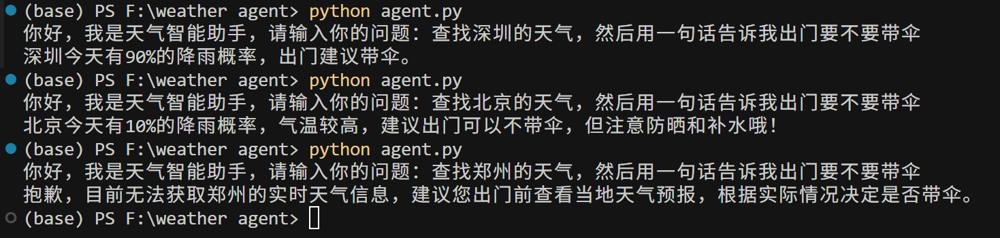

## 天气智能助手（Weather Agent）

本项目是一个基于通义千问（Qwen）大模型 Function Calling 能力的一个简单的智能体工作流。用户可以用自然语言提问天气，模型自动决定是否调用本地天气查询函数，并给出是否需要带伞的建议。

### 项目结构
```
.
├── agent.py              # 主程序
├── weather_search.py     # 模拟外部查询天气的工具（如weather API）
├── requirement.txt       # 环境配置说明
```

### 依赖环境
[requirement.txt](requirement.txt)

### 安装依赖环境
建议使用虚拟环境，在项目根目录下运行：
```bash
pip install -r requirement.txt
```

### 使用的模型
本项目使用的模型为**通义千问-Plus**，Code=`qwen-plus`。
也可以替换为其他LLM，只需修改model name：
```python
model='model-name'
```

### API Key配置
你需要在 `agent.py` 中将 `api_key='API-KEY'` 替换为你自己的通义千问 DashScope API Key
```python
api_key='你的API-KEY'
```

### 功能说明
- 目前仅支持查询“北京/Beijing”和“深圳/Shenzhen”两地的模拟天气。
- 支持中英文城市名自动识别
- 用户输入自然语言问题后，大模型自动判断是否需要调用`get_weather`函数。

### 示例


